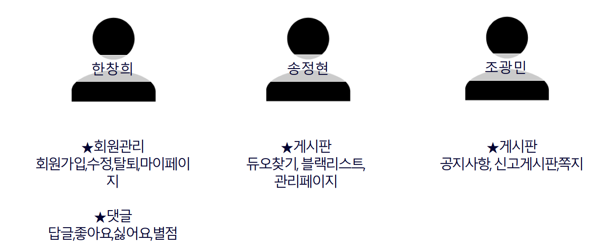
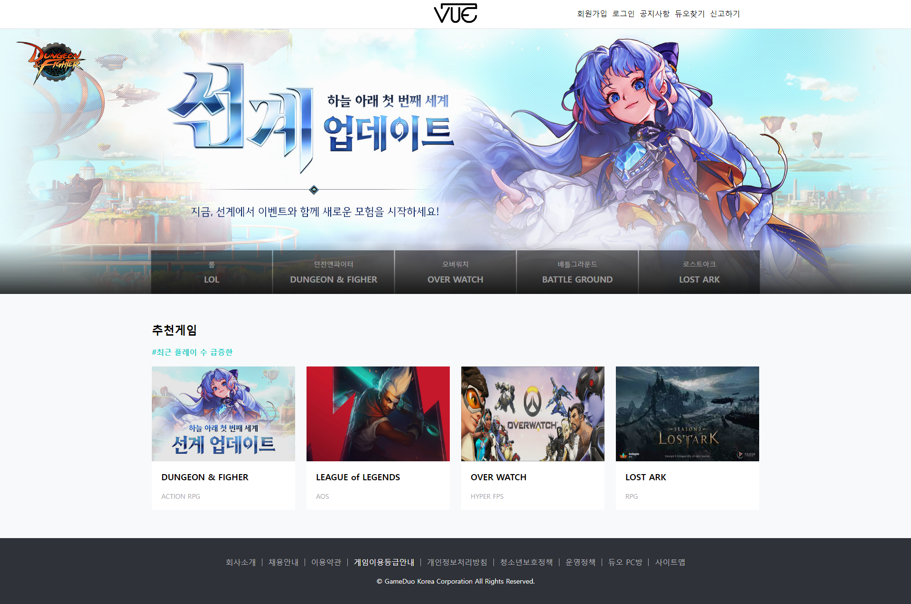
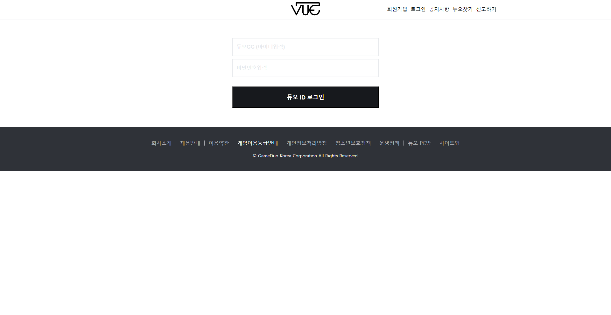
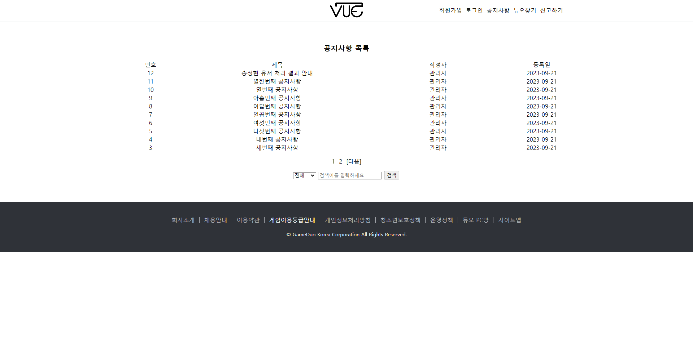
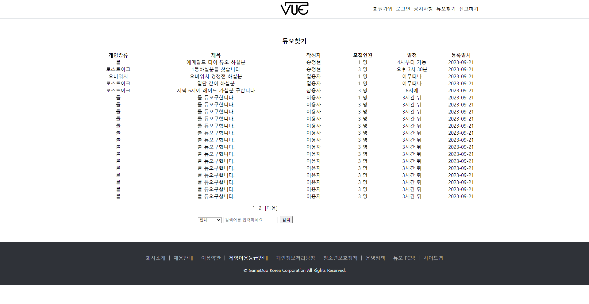
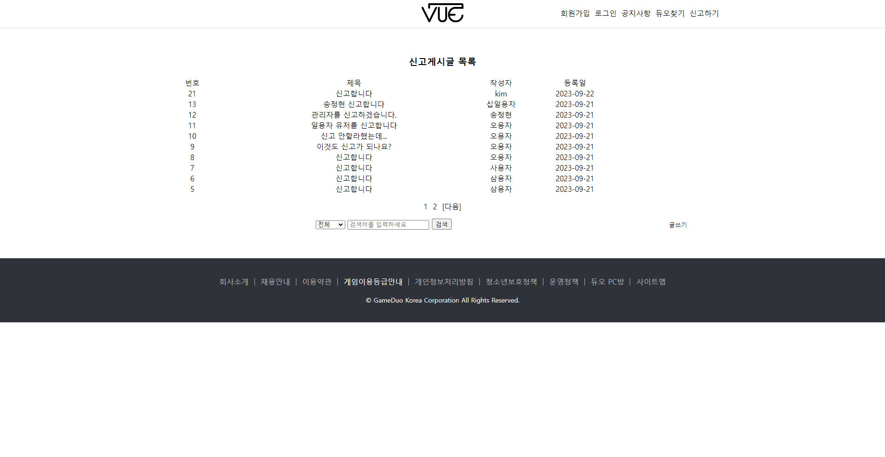

# GameDuo
노라조 - 세미프로젝트(게임해듀오)

<h3>프로젝트 목적<h3>

회사나 학교로 시간대가 애매한 사람들이 같이 게임할 사람을 구하기 위한 서비스를 구현해보기 위해 다음과 같은 서비스를 생각하게 되었다.

<h3>개발 기간</h3>

2023.09.04 ~ 2023.09.22

<h3>개발 목표</h3>

✔ 기존 사이트와는 다르게 댓글로 빠른소통가능

✔ 기존 사이트에서는 신고 기능 밖에 없지만 그에 보완해서 신고 블랙리스트까지 구현함

✔ 기존 사이트는 듀오를 찾는 사람이 게임내 친구 요청을 받아주기 전까지는 상대방의 의사를 알 수 없어 소통이 불가능한 부분이 있다. 그러하여 우리는 게임 할사람을 찾는 게시글을 올리고 댓글을 달아 만듬.

✔ 기존 사이트는  게임종류가 하나지만  다양한 게임 카테고리 별로 모집기능 추가

<h3>주요기능</h3>

	✔ 회원관리(회원가입, 수정, 탈퇴, 마이페이지)  
	✔ 게시판(듀오찾기, 공지사항, 신고게시판)  

<h3>팀 소개 및 팀원 소개</h3>

<h3>Game Duo 주요화면 살펴보기</h3>
<h4>1.메인화면</h4>

<h4>2.로그인화면</h4>

<h4>3.공지사항</h4>

<h4>4.듀오찾기</h4>

<h4>5.신고하기</h4>

